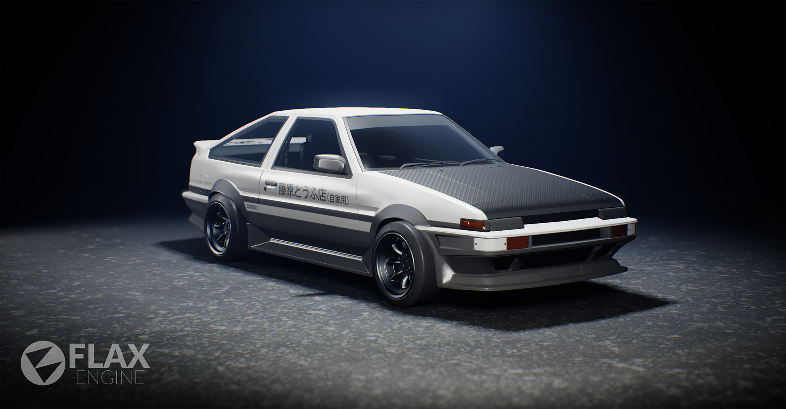
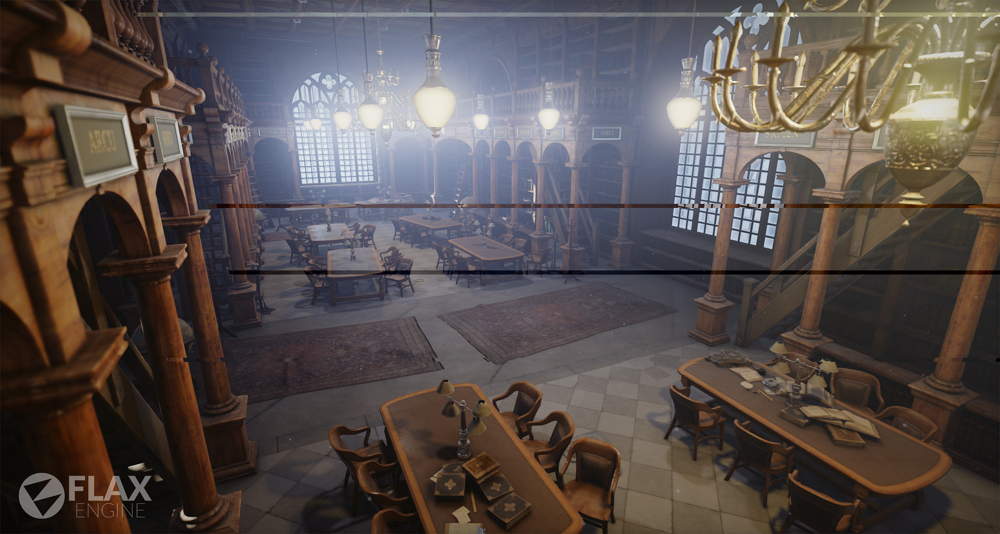

<h1>Flax Engine</h1>

Flax Engine is a high quality modern 3D game engine written in C++ and C#.
From stunning graphics to powerful scripts, it's designed for fast workflow with many ready-to-use features waiting for you right now. To learn more see the website ([www.flaxengine.com](https://flaxengine.com)).

This repository contains full source code of the Flax Engine (excluding NDA-protected platforms support). Documentation source is also available in a separate repository. Anyone is welcome to contribute or use the modified source in Flax-based games.

# Development

* [Homepage](https://flaxengine.com)
* [Dev Blog](https://flaxengine.com/blog)
* [Documentation](https://docs.flaxengine.com)
* [Forum](https://forum.flaxengine.com)
* [Roadmap](https://trello.com/b/NQjLXRCP/flax-roadmap)

# Screenshots

# Getting started

Follow the instructions below to compile and run the engine from source.

## Windows

* Install Visual Studio 2022 or newer
* Install Windows 8.1 SDK or newer (via Visual Studio Installer)
* Install Microsoft Visual C++ 2015 v140 toolset or newer (via Visual Studio Installer)
* Install .NET 8 SDK (or newer) for **Windows x64** (via Visual Studio Installer or [from web](https://dotnet.microsoft.com/en-us/download/dotnet/8.0))
* Install Git with LFS
* Clone repo (with LFS)
* Run **GenerateProjectFiles.bat**
* Open `Flax.sln` and set solution configuration to **Editor.Development** and solution platform to **Win64**
* Set Flax (C++) or FlaxEngine (C#) as startup project
* Compile Flax project (hit F7 or CTRL+Shift+B)
* Optionally set Debug Type to **Managed Only (.NET Core)** to debug C#-only, or **Mixed (.NET Core)** to debug both C++ and C#
* Run Flax (hit F5 key)

## Linux

* Install Visual Studio Code
* Install .NET 8 or 9 SDK ([https://dotnet.microsoft.com/en-us/download/dotnet/8.0](https://dotnet.microsoft.com/en-us/download/dotnet/8.0))
  * Ubuntu: `sudo apt install dotnet-sdk-8.0`
  * Fedora: `sudo dnf install dotnet-sdk-8.0`
  * Arch: `sudo pacman -S dotnet-sdk-8.0 dotnet-runtime-8.0 dotnet-targeting-pack-8.0 dotnet-host`
* Install Vulkan SDK ([https://vulkan.lunarg.com/](https://vulkan.lunarg.com/))
  * Ubuntu: `sudo apt install vulkan-sdk` (deprecated, follow official docs)
  * Fedora: `sudo dnf install vulkan-headers vulkan-tools vulkan-validation-layers`
  * Arch: `sudo pacman -S vulkan-headers vulkan-tools vulkan-validation-layers`
* Install Git with LFS
  * Ubuntu: `sudo apt-get install git git-lfs`
  * Arch: `sudo pacman -S git git-lfs`
  * `git-lfs install`
* Install the required packages:
  * Ubuntu: `sudo apt-get install libx11-dev libxcursor-dev libxinerama-dev zlib1g-dev`
  * Fedora: `sudo dnf install libX11-devel libXcursor-devel  libXinerama-devel ghc-zlib-devel`
  * Arch: `sudo pacman -S base-devel libx11 libxcursor libxinerama zlib`
* Install Clang compiler (version 14 or later):
  * Ubuntu: `sudo apt-get install clang lldb lld`
  * Fedora: `sudo dnf install clang llvm lldb lld`
  * Arch: `sudo pacman -S clang lldb lld`
* Clone the repository (with LFS)
  * git-lfs clone https://github.com/FlaxEngine/FlaxEngine.git
* Run `./GenerateProjectFiles.sh`
* Open workspace with Visual Code
* Build and run (configuration and task named `Flax|Editor.Linux.Development|x64`)

## Mac

* Install XCode 16.4 (or newer)
* Install .NET 8 SDK (or newer) ([https://dotnet.microsoft.com/en-us/download/dotnet/8.0](https://dotnet.microsoft.com/en-us/download/dotnet/8.0))
* Install Vulkan SDK ([https://vulkan.lunarg.com/](https://vulkan.lunarg.com/))
* Clone repo (with LFS)
* Run `GenerateProjectFiles.command`
* Open workspace with XCode or Visual Studio Code
* Build and run (configuration `Editor.Mac.Development`)

## Troubleshooting

* `Could not execute because the specified command or file was not found.`

Restart PC - ensure DotNet is added to PATH for command line tools execution.

* `Microsoft.NET.TargetFrameworkInference.targets(141,5): error NETSDK1045: The current .NET SDK does not support targeting .NET 8.0.  Either target .NET 5.0 or lower, or use a version of the .NET SDK that supports .NET 8.0`

Use Visual Studio 2022, older versions are not supported by .NET SDK 8.

* `Building for Windows without Vulkan rendering backend (Vulkan SDK is missing)`

Install the Vulkan SDK then set an environment variable to provide the path to the SDK prior to running GenerateProjectFiles.bat: `set VULKAN_SDK=%sdk_path%`.

* `The NuGetSdkResolver did not resolve this SDK`

Install `.NET SDK`, `NuGet package manager` and `NuGet targets and build tasks` in Visual Studio components.

## Workspace directory

- **Binaries/** - executable files
  - **Editor/** - Flax Editor binaries
  - **Tools/** - tools binaries
- **Cache/** - local data cache folder used by the engine and tools
  - **Intermediate/** - intermediate files and cache for engine build
    - ***ProjectName*/** - per-project build cache data
    - **Deps/** - Flax.Build dependencies building cache
  - **Projects/** - project files location
- **Content/** - assets and binary files used by the engine and editor
- **Development/** - engine development files
  - **Scripts/** - utility scripts
- **Source/** - source code location
  - **Editor/** - Flax Editor source code
  - **Engine/** - Flax Engine source code
  - **Platforms/** - per-platform sources and dependency files
    - **DotNet/** - C# dependencies
    - **Editor/** - Flax Editor binaries
    - ***PlatformName*/** - per-platform files
      - **Binaries/** - per-platform binaries
        - **Game/** - Flax Game binaries
        - **ThirdParty/** - prebuilt 3rd Party binaries
  - **Shaders/** - shaders source code
  - **ThirdParty/** - 3rd Party source code
  - **Tools/** - development tools source code

# Licensing and Contributions

Using Flax source code is strictly governed by the Flax Engine End User License Agreement. If you don't agree to those terms, as amended from time to time, you are not permitted to access or use Flax Engine.

We welcome any contributions to Flax Engine development through pull requests on GitHub. Most of our active development is in the master branch, so we prefer to take pull requests there (particularly for new features). We try to make sure that all new code adheres to the Flax coding standards. All contributions are governed by the terms of the [EULA](https://flaxengine.com/licensing/).

## SAST Tools

[PVS-Studio](https://pvs-studio.com/en/pvs-studio/?utm_source=website&utm_medium=github&utm_campaign=open_source) - static analyzer for C, C++, C#, and Java code.

## 🌐 Web Resources & Interactive Index
- [WOOD BLOCK JAM](https://eduquestses.pages.dev/wood-block-jam.html)
- [CAKE MERGE 2](https://quizzesarena.github.io/cake-merge-2.html)
- [BUBBLE SHOOTER PANDA BLAST](https://eduquestses.pages.dev/bubble-shooter-panda-blast.html)
- [TSUNAMI BRAINROTS ONLINE](https://eduquestsfr.pages.dev/tsunami-brainrots-online.html)
- [CLASH CROWD GAME](https://eduquestses.pages.dev/clash-crowd-game.html)
- [JEWELRY IDLE](https://eduquestses.pages.dev/jewelry-idle.html)
- [FNF 2 PLAYER](https://eduquestsfr.pages.dev/fnf-2-player.html)
- [BRICK BLAZE](https://eduquestses.pages.dev/brick-blaze.html)
- [FISH STORY 3](https://eduquestses.pages.dev/fish-story-3.html)
- [CATEGORY AVOID295](https://eduquestses.pages.dev/category-avoid295.html)
- [CATEGORY SCRATCH](https://eduquests.onrender.com/category-scratch.html)
- [CATEGORY INCREMENTAL388](https://eduquestkr.pages.dev/category-incremental388.html)
- [CATEGORY AGILITY 3](https://eduquestsfr.pages.dev/category-agility-3.html)
- [MOUNTAIN BUS DRIVER](https://eduquestses.pages.dev/mountain-bus-driver.html)
- [CATEGORY PUZZLE 3](https://eduquests.onrender.com/category-puzzle-3.html)
- [COLOR SORT PUZZLE](https://eduquests.github.io/color-sort-puzzle.html)
- [MOW IT](https://eduquests.github.io/mow-it.html)
- [CATEGORY CONTROLLER 2](https://ieduquests.web.app/category-controller-2.html)
- [ARROWS PUZZLE ESCAPE](https://eduquestsfr.pages.dev/arrows-puzzle-escape.html)
- [CATEGORY CARDS](https://eduquestkr.pages.dev/category-cards.html)
- [GOLD MINER CLASSIC](https://eduquestses.pages.dev/gold-miner-classic.html)
- [DOTS MASTER](https://ieduquests.web.app/dots-master.html)
- [HERO TRANSFORM RACE](https://eduquestsfr.pages.dev/hero-transform-race.html)
- [ULTIMATE TRANSPORT DRIVING SIM](https://eduquestsfr.pages.dev/ultimate-transport-driving-sim.html)
- [BOUNCEPOP QUEST](https://eduquestsfr.pages.dev/bouncepop-quest.html)
- [MONSTER SCHOOL VS SIREN HEAD](https://eduquests.github.io/monster-school-vs-siren-head.html)
- [PIN MASTER SCREW PUZZLE QUEST BRAIN GAMES](https://eduquests.onrender.com/pin-master-screw-puzzle-quest-brain-games.html)
- [MY COTTAGECORE AESTHETIC LOOK](https://eduquestkr.pages.dev/my-cottagecore-aesthetic-look.html)
- [CATEGORY MAHJONG CONNECT](https://eduquests.onrender.com/category-mahjong-connect.html)
- [WORM HUNT](https://ieduquests.web.app/worm-hunt.html)
- [NOOB JAILBREAK 2](https://eduquests.github.io/noob-jailbreak-2.html)
- [FRUIT CATCHER](https://eduquests.github.io/fruit-catcher.html)
- [CATEGORY RUNNING107](https://ieduquests.web.app/category-running107.html)
- [FARM BUSINESS SAGA](https://ieduquests.web.app/farm-business-saga.html)
- [BLOCK COMBO BLAST](https://eduquestsfr.pages.dev/block-combo-blast.html)
- [CUBE COMBO](https://eduquestkr.pages.dev/cube-combo.html)
- [PIN MASTER SCREW PUZZLE QUEST BRAIN GAMES](https://eduquestsfr.pages.dev/pin-master-screw-puzzle-quest-brain-games.html)
- [HAZMOB FPS](https://eduquestses.pages.dev/hazmob-fps.html)
- [CATEGORY CASUAL 16](https://ieduquests.web.app/category-casual-16.html)
- [CATEGORY CRAFTING45](https://eduquestkr.pages.dev/category-crafting45.html)
- [RESIDENT EVIL PURGE OPERATION](https://eduquestses.pages.dev/resident-evil-purge-operation.html)
- [CATEGORY COLLECT565](https://eduquests.onrender.com/category-collect565.html)
- [MINEBLOCKS 3D MAZE](https://eduquestsfr.pages.dev/mineblocks-3d-maze.html)
- [ROBBOTTO](https://ieduquests.web.app/robbotto.html)
- [CATEGORY CASUAL 15](https://ieduquests.web.app/category-casual-15.html)
- [REVERSI](https://eduquestsfr.pages.dev/reversi.html)
- [CATEGORY HORROR](https://eduquests.onrender.com/category-horror.html)
- [3D MATCH PUZZLE MANIA](https://eduquestsfr.pages.dev/3d-match-puzzle-mania.html)
- [CATCH A FISH OBBY](https://ieduquests.web.app/catch-a-fish-obby.html)
- [CATEGORY PUZZLE 2](https://eduquestsfr.pages.dev/category-puzzle-2.html)
- [CATEGORY MAKEUP CATEGORY](https://eduquestses.pages.dev/category-makeup-category.html)
- [CATEGORY DRAWING GAME](https://ieduquests.web.app/category-drawing-game.html)
- [CATEGORY WAR137](https://ieduquests.web.app/category-war137.html)
- [CAR COLLISION MASTER](https://eduquestsfr.pages.dev/car-collision-master.html)
- [PORT SHIPPING TYCOON](https://eduquests.github.io/port-shipping-tycoon.html)
- [DEVS SIMULATOR](https://eduquestses.pages.dev/devs-simulator.html)
- [CATEGORY FIGHTING](https://eduquests.onrender.com/category-fighting.html)
- [SOLITAIRE QUEST](https://eduquestses.pages.dev/solitaire-quest.html)
- [CATEGORY SURVIVAL365](https://ieduquests.web.app/category-survival365.html)
- [MY PERFECT FARM](https://eduquestsfr.pages.dev/my-perfect-farm.html)
- [CATEGORY ART](https://eduquestsfr.pages.dev/category-art.html)
- [CATEGORY HERO](https://ieduquests.web.app/category-hero.html)
- [ICONIC HALLOWEEN COSTUMES](https://eduquestses.pages.dev/iconic-halloween-costumes.html)
- [CATEGORY LOGIC538](https://ieduquests.web.app/category-logic538.html)
- [ZEN MASTER 3 TILES](https://eduquestkr.pages.dev/zen-master-3-tiles.html)
- [MERGE FUSION](https://eduquestsfr.pages.dev/merge-fusion.html)
- [CONTRACT DEER HUNTER](https://eduquests.github.io/contract-deer-hunter.html)
- [TRAFFIC PARKING](https://eduquestsfr.pages.dev/traffic-parking.html)
- [CATEGORY BIKE](https://eduquestkr.pages.dev/category-bike.html)
- [BIG BAD APE](https://ieduquests.web.app/big-bad-ape.html)
- [CATEGORY ESCAPE 2](https://ieduquests.web.app/category-escape-2.html)
- [SOKOBAN PUZZLE GAME](https://eduquests.github.io/sokoban-puzzle-game.html)
- [INDEX18](https://eduquestkr.pages.dev/index18.html)
- [RACING MASTER 3D](https://eduquestkr.pages.dev/racing-master-3d.html)
- [STAR WING](https://eduquests.onrender.com/star-wing.html)
- [INDEX28](https://eduquestsfr.pages.dev/index28.html)
- [CATEGORY FLASH](https://eduquestses.pages.dev/category-flash.html)
- [BFFS GOLDEN HOUR](https://ieduquests.web.app/bffs-golden-hour.html)
- [BATTLE ISLAND 2](https://ieduquests.web.app/battle-island-2.html)
- [CATEGORY FOOD95](https://ieduquests.web.app/category-food95.html)
- [4 HEXA](https://eduquestses.pages.dev/4-hexa.html)
- [CATEGORY TITANIUMNETWORK](https://ieduquests.web.app/category-titaniumnetwork.html)
- [WACKY WHEELS](https://eduquests.github.io/wacky-wheels.html)
- [CATEGORY COLOR](https://eduquestkr.pages.dev/category-color.html)
- [BALL EATING SIMULATOR](https://ieduquests.web.app/ball-eating-simulator.html)
- [CAR PARKING MASTER 3D REAL DRIVING SIMULATOR](https://eduquestses.pages.dev/car-parking-master-3d-real-driving-simulator.html)
- [EMOJI SMASHER SMILEY GAME](https://ieduquests.web.app/emoji-smasher-smiley-game.html)
- [GOODS SORTING SHOPPING MASTER](https://eduquestses.pages.dev/goods-sorting-shopping-master.html)
- [CATEGORY TOWER DEFENSE 3](https://ieduquests.web.app/category-tower-defense-3.html)
- [BRIDGE FIGHT](https://eduquestkr.pages.dev/bridge-fight.html)
- [SQUID GAME ORIGINAL](https://ieduquests.web.app/squid-game-original.html)
- [OBBY PRISON CRAFT ESCAPE](https://brainquests.pages.dev/obby-prison-craft-escape.html)
- [PHYSICS BOX 2](https://eduquestses.pages.dev/physics-box-2.html)
- [WAR OF GUN](https://eduquestses.pages.dev/war-of-gun.html)
- [HOUSE OF CELESTINA](https://eduquestsfr.pages.dev/house-of-celestina.html)
- [DTA BEST THIEF](https://eduquestsfr.pages.dev/dta-best-thief.html)
- [BASKETBALL RUSH](https://eduquests.github.io/basketball-rush.html)
- [CATEGORY FOOD95](https://learnaction.github.io/category-food95.html)
- [INDEX17](https://eduquestses.pages.dev/index17.html)
- [BUBBLE SHOOTER REMASTERED](https://learnaction.github.io/bubble-shooter-remastered.html)
- [MINE QUEST DAILY](https://eduquestses.pages.dev/mine-quest-daily.html)
- [CATEGORY COLOR197](https://learnaction.netlify.app/category-color197.html)
- [SUPERMARKET MANAGER SIMULATOR](https://eduquestses.pages.dev/supermarket-manager-simulator.html)
- [JELI2D](https://eduquestkr.pages.dev/jeli2d.html)
- [FASHION DYE PRO](https://brainquests.pages.dev/fashion-dye-pro.html)
- [CRAZY SCREW KING](https://brainquests.pages.dev/crazy-screw-king.html)
- [INDEX18](https://eduquestses.pages.dev/index18.html)
- [INDEX14](https://eduquests.onrender.com/index14.html)
- [GMOD BOMBS](https://eduquestkr.pages.dev/gmod-bombs.html)
- [CATEGORY BOARDGAMES](https://eduquestses.pages.dev/category-boardgames.html)
- [CATEGORY SOLDIER11](https://eduquestkr.pages.dev/category-soldier11.html)
- [ROCKET FEST](https://learnaction.netlify.app/rocket-fest.html)
- [MOJICON WINTER CONNECT](https://learnaction.netlify.app/mojicon-winter-connect.html)
- [CATEGORY SHOOTER 3](https://eduquests.pages.dev/category-shooter-3.html)
- [FAIRY WINGERELLA](https://learnaction.github.io/fairy-wingerella.html)
- [YOGA MASTER](https://learnaction.netlify.app/yoga-master.html)
- [GIANT WANTED MONSTER](https://eduquestsfr.pages.dev/giant-wanted-monster.html)
- [WORD SOLITAIRE](https://eduquestspt.pages.dev/word-solitaire.html)
- [HIGH SPEED CRAZY BIKE](https://eduquests.github.io/high-speed-crazy-bike.html)
- [MY LITTLE FARM](https://eduquests.pages.dev/my-little-farm.html)
- [FURRY WEDDING PROPOSAL](https://learnaction.github.io/furry-wedding-proposal.html)
- [CATEGORY MOUSE1 707](https://eduquestses.pages.dev/category-mouse1-707.html)
- [CATEGORY ROBOT49](https://eduquestses.pages.dev/category-robot49.html)
- [CATEGORY BYEPASSHUB](https://eduquestses.pages.dev/category-byepasshub.html)
- [DRAW WAR](https://eduquests.pages.dev/draw-war.html)
- [BLOCK PIXEL GUN APOCALYPSE 3](https://learnaction.netlify.app/block-pixel-gun-apocalypse-3.html)
- [CATEGORY BIKE](https://eduquestspt.pages.dev/category-bike.html)
- [PURRFECT PUZZLE](https://eduquests.pages.dev/purrfect-puzzle.html)
- [LUCKY VEGAS BLACKJACK](https://learnaction.github.io/lucky-vegas-blackjack.html)
- [CATEGORY MINECRAFT 2](https://learnaction.netlify.app/category-minecraft-2.html)
