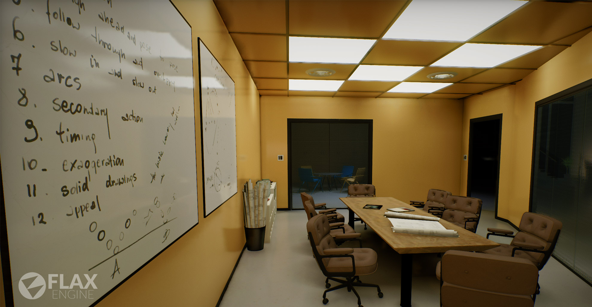

<h1>Flax Engine</h1>

Flax Engine is a high quality modern 3D game engine written in C++ and C#.
From stunning graphics to powerful scripts, it's designed for fast workflow with many ready-to-use features waiting for you right now. To learn more see the website ([www.flaxengine.com](https://flaxengine.com)).

This repository contains full source code of the Flax Engine (excluding NDA-protected platforms support). Anyone is welcome to contribute or use the modified source in Flax-based games.

# Development

* [Homepage](https://flaxengine.com)
* [Dev Blog](https://flaxengine.com/blog)
* [Documentation](https://docs.flaxengine.com)
* [Forum](https://forum.flaxengine.com)
* [Roadmap](https://trello.com/b/NQjLXRCP/flax-roadmap)

# Screenshots

# Getting started

Follow the instructions below to compile and run the engine from source.

## Windows

* Install Visual Studio 2022 or newer
* Install Windows 8.1 SDK or newer (via Visual Studio Installer)
* Install Microsoft Visual C++ 2015 v140 toolset or newer (via Visual Studio Installer)
* Install .NET 8 or 9 SDK for **Windows x64** (via Visual Studio Installer or [from web](https://dotnet.microsoft.com/en-us/download/dotnet/8.0))
* Install Git with LFS
* Clone repo (with LFS)
* Run **GenerateProjectFiles.bat**
* Open `Flax.sln` and set solution configuration to **Editor.Development** and solution platform to **Win64**
* Set Flax (C++) or FlaxEngine (C#) as startup project
* Compile Flax project (hit F7 or CTRL+Shift+B)
* Optionally set Debug Type to **Managed Only (.NET Core)** to debug C#-only, or **Mixed (.NET Core)** to debug both C++ and C#
* Run Flax (hit F5 key)

## Linux

* Install Visual Studio Code
* Install .NET 8 or 9 SDK ([https://dotnet.microsoft.com/en-us/download/dotnet/8.0](https://dotnet.microsoft.com/en-us/download/dotnet/8.0))
  * Ubuntu: `sudo apt install dotnet-sdk-8.0`
  * Arch: `sudo pacman -S dotnet-sdk-8.0 dotnet-runtime-8.0 dotnet-targeting-pack-8.0 dotnet-host`
* Install Vulkan SDK ([https://vulkan.lunarg.com/](https://vulkan.lunarg.com/))
  * Ubuntu: `sudo apt install vulkan-sdk`
  * Arch: `sudo pacman -S spirv-tools vulkan-headers vulkan-tools vulkan-validation-layers`
* Install Git with LFS
  * Ubuntu: `sudo apt-get install git git-lfs`
  * Arch: `sudo pacman -S git git-lfs`
  * `git-lfs install`
* Install the required packages:
  * Ubuntu: `sudo apt-get install libx11-dev libxcursor-dev libxinerama-dev zlib1g-dev`
  * Arch: `sudo pacman -S base-devel libx11 libxcursor libxinerama zlib`
* Install Clang compiler (version 6 or later):
  * Ubuntu: `sudo apt-get install clang lldb lld`
  * Arch: `sudo pacman -S clang lldb lld`
* Clone the repository (with LFS)
* Run `./GenerateProjectFiles.sh`
* Open workspace with Visual Code
* Build and run (configuration and task named `Flax|Editor.Linux.Development|x64`)

## Mac

* Install XCode
* Install .NET 8 or 9 SDK ([https://dotnet.microsoft.com/en-us/download/dotnet/8.0](https://dotnet.microsoft.com/en-us/download/dotnet/8.0))
* Install Vulkan SDK ([https://vulkan.lunarg.com/](https://vulkan.lunarg.com/))
* Clone repo (with LFS)
* Run `GenerateProjectFiles.command`
* Open workspace with XCode or Visual Studio Code
* Build and run (configuration `Editor.Mac.Development`)

#### Troubleshooting

* `Could not execute because the specified command or file was not found.`

Restart PC - ensure DotNet is added to PATH for command line tools execution.

* `Microsoft.NET.TargetFrameworkInference.targets(141,5): error NETSDK1045: The current .NET SDK does not support targeting .NET 8.0.  Either target .NET 5.0 or lower, or use a version of the .NET SDK that supports .NET 8.0`

Use Visual Studio 2022, older versions are not supported by .NET SDK 8.

* `Building for Windows without Vulkan rendering backend (Vulkan SDK is missing)`

Install the Vulkan SDK then set an environment variable to provide the path to the SDK prior to running GenerateProjectFiles.bat: `set VULKAN_SDK=%sdk_path%`.

* `The NuGetSdkResolver did not resolve this SDK`

Install `.NET SDK`, `NuGet package manager` and `NuGet targets and build tasks` in Visual Studio components.

## Workspace directory

- **Binaries/** - executable files
  - **Editor/** - Flax Editor binaries
  - **Tools/** - tools binaries
- **Cache/** - local data cache folder used by the engine and tools
  - **Intermediate/** - intermediate files and cache for engine build
    - ***ProjectName*/** - per-project build cache data
    - **Deps/** - Flax.Build dependencies building cache
  - **Projects/** - project files location
- **Content/** - assets and binary files used by the engine and editor
- **Development/** - engine development files
  - **Scripts/** - utility scripts
- **Source/** - source code location
  - **Editor/** - Flax Editor source code
  - **Engine/** - Flax Engine source code
  - **Platforms/** - per-platform sources and dependency files
    - **DotNet/** - C# dependencies
    - **Editor/** - Flax Editor binaries
    - ***PlatformName*/** - per-platform files
      - **Binaries/** - per-platform binaries
        - **Game/** - Flax Game binaries
        - **ThirdParty/** - prebuilt 3rd Party binaries
  - **Shaders/** - shaders source code
  - **ThirdParty/** - 3rd Party source code
  - **Tools/** - development tools source code

# Licensing and Contributions

Using Flax source code is strictly governed by the Flax Engine End User License Agreement. If you don't agree to those terms, as amended from time to time, you are not permitted to access or use Flax Engine.

We welcome any contributions to Flax Engine development through pull requests on GitHub. Most of our active development is in the master branch, so we prefer to take pull requests there (particularly for new features). We try to make sure that all new code adheres to the Flax coding standards. All contributions are governed by the terms of the [EULA](https://flaxengine.com/licensing/).

## SAST Tools

[PVS-Studio](https://pvs-studio.com/en/pvs-studio/?utm_source=website&utm_medium=github&utm_campaign=open_source) - static analyzer for C, C++, C#, and Java code.
